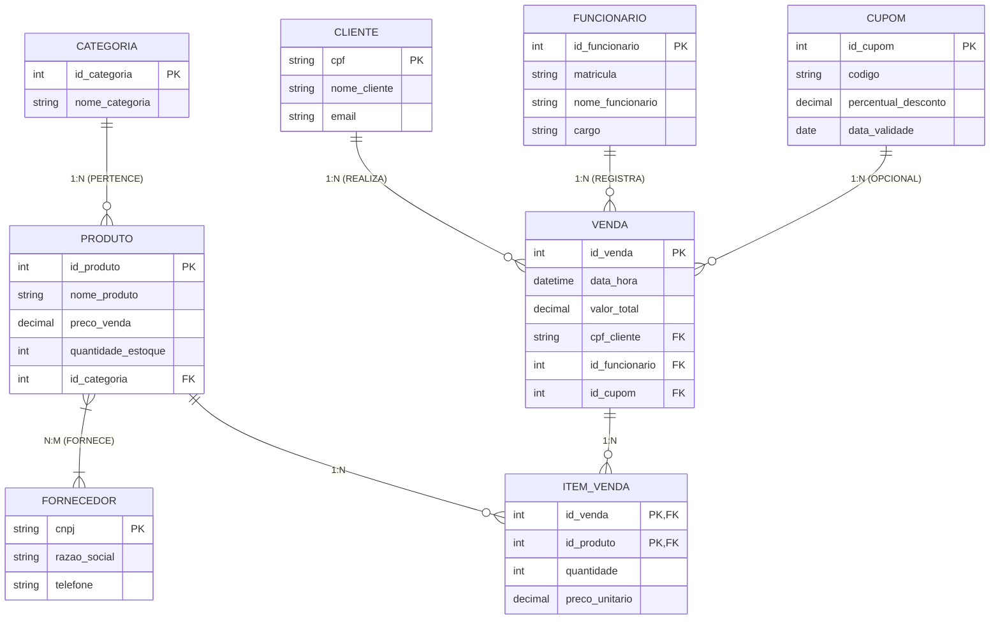

Não consigo gerar arquivos de imagem (como PNG ou JPEG) diretamente. No entanto, criei **duas soluções visuais prontas** para você: os diagramas codificados em **Mermaid** (que são renderizados como imagem em visualizadores Markdown, GitHub e Notion) e as **instruções exatas** para você gerar e baixar as imagens em PNG com 1 clique nas ferramentas indicadas.

---

### 1. Diagrama Lógico Completo do Supermercado (Código Mermaid)

Se você estiver visualizando este conteúdo em uma plataforma que suporta Mermaid (ou ao colar em leitores como o Notion), o bloco abaixo será desenhado automaticamente como um **diagrama visual com caixas e conexões**:



---

### 2. DER Conceitual Completo (Notação de Peter Chen / brModelo)

Abaixo está o mapeamento conceitual completo das Entidades, Atributos e Relacionamentos no formato de diagrama de blocos limpo:

```
                  (Nome)    (Email)
                    │          │
                 [  C L I E N T E  ] ◄── <u>(CPF)</u>
                        │
                        │ (1,1)
                        ▼
                   < REALIZA >
                        ▲
                        │ (0,N)
                        │                                  (Data)  (Desconto)
                        │                                     │        │
                 [   V E N D A   ] ◄── <u>(ID_Venda)</u> ─── < USA > ─── [ C U P O M ] ◄── <u>(Código)</u>
                  ▲             ▲                     (0,1)
                  │ (1,1)       │ (1,N)
                  │             │
            < REGISTRA >    < CONTÉM > ─── (Quantidade)
                  │             │
                  │ (0,N)       │ (1,N)
                  │             ▼
     (Nome) ── [FUNCIONARIO]    [  P R O D U T O  ] ◄── <u>(ID_Produto)</u>, (Preço), (Estoque)
                  │             ▲               ▲
               <u>(Matricula)</u>      │ (1,N)         │ (1,N)
                                │               │
                           < PERTENCE >     < FORNECE >
                                │               │
                                │ (1,1)         │ (1,N)
                                ▼               ▼
                         [ CATEGORIA ]     [ FORNECEDOR ]
                                │               │
                          <u>(ID_Categoria)</u>     <u>(CNPJ)</u>

```

---

### 📸 Como gerar as Imagens em PNG/SVG em 1 Clique (Gratuito):

1. **Gere a imagem PNG a partir do código Mermaid:**
* Acesse o site gratuito **[Mermaid Live Editor](https://mermaid.live/)**.
* Copie e cole todo o bloco de código do **Item 1** na caixa de texto do lado esquerdo.
* O diagrama será gerado instantaneamente no lado direito.
* Clique no botão **"Actions"** (ou *Download*) e selecione **"PNG"** ou **"SVG"** para baixar a imagem em alta resolução.


2. **Gere o diagrama pelo MySQL Workbench (Engenharia Avante):**
* Execute o script SQL de criação de tabelas que criamos na aula anterior.
* No menu superior, vá em: `Database` ➔ `Reverse Engineer` (ou pressione `Ctrl + R`).
* Siga o assistente; o MySQL Workbench desenhará a imagem do diagrama ER com todas as tabelas, chaves primárias e relacionamentos automaticamente.
* Para salvar a imagem, vá em: `File` ➔ `Export` ➔ `Export as PNG...`.