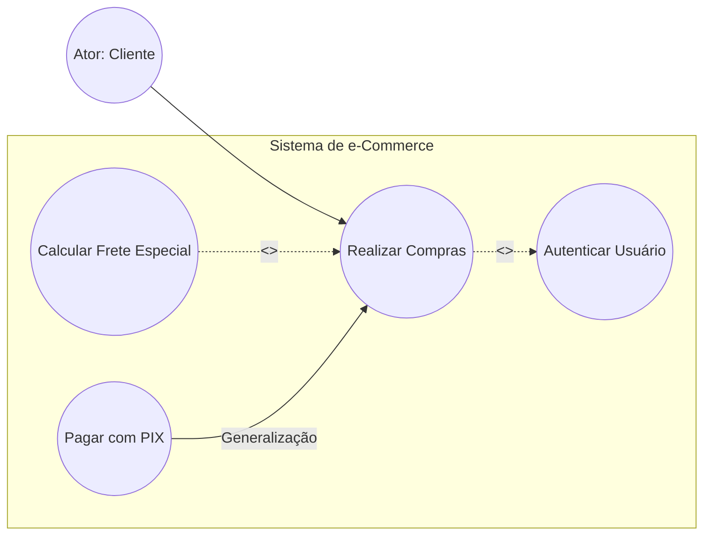
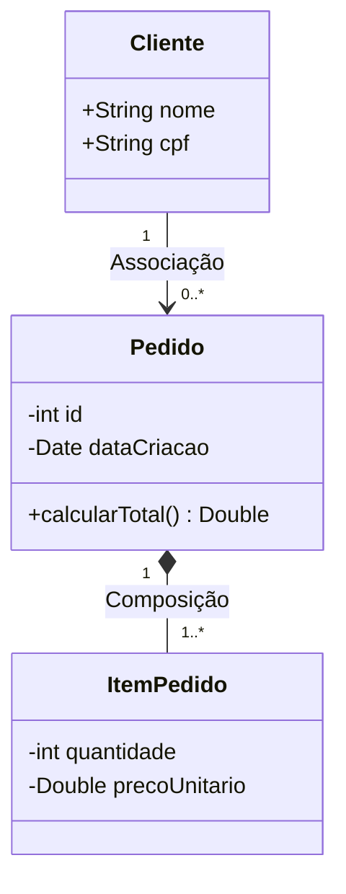
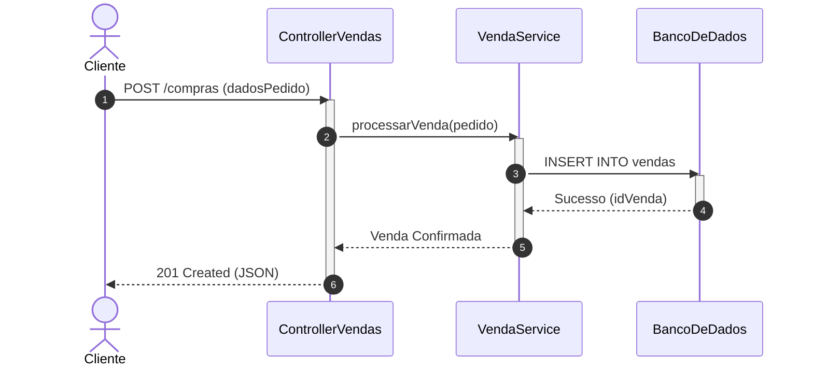
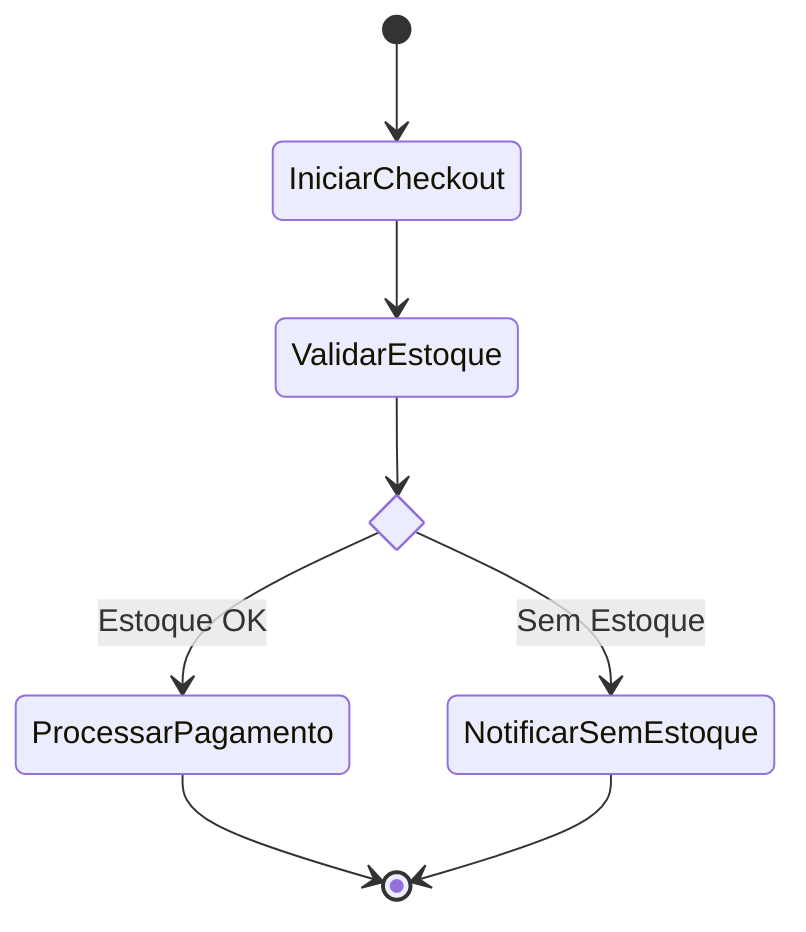
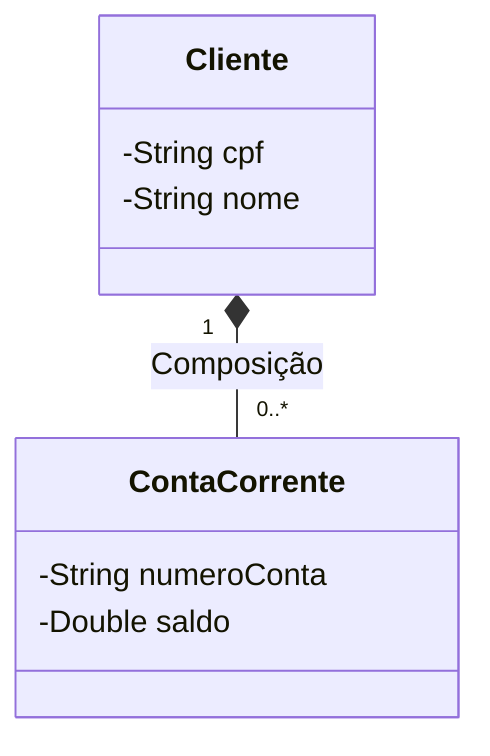
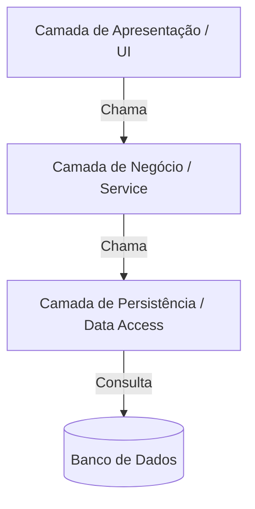
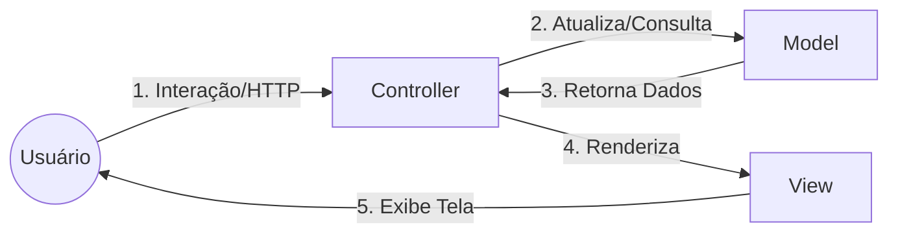

# 🏛️ MANUAL INTEGRAL DE ENGENHARIA DE SOFTWARE E ARQUITETURA DE SISTEMAS

**Prof. Dr. em Engenharia de Software — Consultor Especialista em Arquitetura de Sistemas e Agilidade**

---

## 🎯 NOTA DE BOAS-VINDAS E DIRETRIZ DIDÁTICA

Seja bem-vindo(a) à disciplina que transforma o ato de "escrever código" em uma **profissão rigorosa, escalável e sustentável**.

Muitos iniciantes acreditam que o desenvolvimento de software se resume à programação. No entanto, sem engenharia, o código se torna um labirinto inmanutenível. A **Engenharia de Software** provê os processos, modelos, arquiteturas e padrões para garantir que sistemas complexos sejam entregues dentro do prazo, dentro do orçamento, com alta qualidade e facilidade de evolução.

Neste manual, conectaremos a teoria consagrada da academia às práticas reais do mercado de tecnologia. Prepare seu bloco de notas e bons estudos!

---

# MÓDULO 1: Fundamentos, Processos e Metodologias Ágeis

---

## 1.1 Origem da Engenharia de Software e a Crise do Software

### 1. 📖 Explicação Expositiva e Detalhada

Na década de 1960, o hardware evoluiu a passos largos, tornando-se mais barato e potente. Essa evolução permitiu que os computadores executassem programas exponencialmente maiores. No entanto, a forma de construir software continuava artesanal, sem métodos formais ou controle de projeto.

O resultado foi a **Crise do Software**, termo cunhado na conferência da NATO em Garmisch (Alemanha, 1968). A crise foi caracterizada por:

* Projetos que estouravam constantemente prazos e orçamentos.
* Software não confiável, com bugs críticos em produção.
* Código de baixíssima qualidade e extremamente difícil de manter.
* Sistemas entregues que não atendiam às reais necessidades dos clientes.

Para superar esse cenário, nasceu a **Engenharia de Software**: a aplicação de uma abordagem sistemática, disciplinada e quantificável ao desenvolvimento, operação e manutenção de software.

### 2. 💡 Analogia Prática do Cotidiano

Pense na diferença entre **Construir um Barraco de Madeira** e **Construir um Edifício de 30 Andares**.

* Para o barraco, uma pessoa sozinha, usando intuição, pregos e tábuas, consegue finalizar a obra em um final de semana. Se der errado, o custo de reconstruir é baixo.
* Para o edifício de 30 andares, a intuição é fatal. É indispensável o rigor da Engenharia Civil: cálculo estrutural, análise do solo, plantas arquitetônicas, gestão de suprimentos e cronograma.

A Crise do Software ocorreu porque o mercado tentou construir "edifícios de 30 andares" usando as técnicas intuitivas de quem só sabia fazer "barracos de madeira".

### 3. 📊 Representação Visual (Causa e Efeito)

```
[ Avanço do Hardware ] ───> [ Demandas de Software Gigantescas ]
                                         │
                                         ▼
                      [ Métodos Artesanais de Programação ]
                                         │
                                         ▼
                             CRISE DO SOFTWARE (1968)
               ┌─────────────────────────┼─────────────────────────┐
               ▼                         ▼                         ▼
      Atrasos no Cronograma    Estouro de Orçamento    Sistemas Inmanuteníveis
                                         │
                                         ▼
                          NASCIMENTO DA ENGENHARIA DE SOFTWARE
                          (Processos, Qualidade e Arquitetura)

```

### 4. ✏️ Exercício Prático Dirigido

Uma startup de saúde desenvolveu um aplicativo de prontuário médico sem qualquer documentação, testes automatizados ou gestão de requisitos. Após 2 anos de sucesso, a equipe não consegue adicionar novos recursos sem quebrar funções antigas, e o sistema cai diariamente.
**Pergunta:** Identifique 3 sintomas da "Crise do Software" presentes nesse cenário e proponha 2 ações da Engenharia de Software para reverter a situação.

### 5. ✅ Resposta e Explicação Passo a Passo

**Sintomas da Crise do Software identificados:**

1. *Inmanutenibilidade (Código Espaguete):* A adição de novos recursos quebra funcionalidades existentes devido ao alto acoplamento e ausência de arquitetura.
2. *Falta de Confiabilidade (Instabilidade):* O aplicativo cai diariamente em produção.
3. *Ausência de Qualidade de Processo:* Inexistência de testes automatizados e de documentação mínima.

**Ações Corretivas propostas:**

1. *Implantação de Testes Automatizados (Regressão):* Criar uma suíte de testes de integração e unidade para garantir que alterações não quebrem o sistema.
2. *Refatoração Arquitetural:* Modularizar o código existente, aplicando padrões de projeto para reduzir o acoplamento e isolar as regras de negócio.

---

## 1.2 Áreas do Conhecimento da Engenharia de Software (SWEBOK)

### 1. 📖 Explicação Expositiva e Detalhada

O **SWEBOK** (*Software Engineering Body of Knowledge*), mantido pelo IEEE Computer Society, é o guia que consolida o corpo de conhecimento da Engenharia de Software em Áreas do Conhecimento (*Knowledge Areas - KAs*). Ele define o ciclo de vida do software em fases encadeadas e complementares:

```
[ Requisitos ] ──> [ Design/Arquitetura ] ──> [ Construção ] ──> [ Testes ] ──> [ Manutenção ]

```

1. **Engenharia de Requisitos:** Elicitação, análise, especificação e validação das necessidades dos stakeholders.
2. **Design de Software (Arquitetura):** Definição da estrutura interna, componentes, interfaces e padrões do sistema.
3. **Construção de Software:** A codificação propriamente dita, aplicando boas práticas, algoritmos e estruturas de dados.
4. **Testes de Software:** Verificação e validação sistemática para encontrar defeitos antes da implantação.
5. **Manutenção de Software:** Evolução do sistema pós-implantação (corretiva, adaptativa, perfeita ou preventiva).
6. **Gerência de Configuração e Engenharia de Processos:** Controle de versões, integração contínua e melhoria de processos.

---

## 1.3 Processos de Software: Preditivos vs. Ágeis (Scrum e XP)

### 1. 📖 Explicação Expositiva e Detalhada

#### A) Modelos Tradicionais / Preditivos

* **Cascata (Waterfall):** Fases sequenciais e rígidas. Uma fase só inicia quando a anterior termina. Ideal para projetos onde os requisitos são **100% estáveis e imutáveis**.
* **Incremental:** O software é entregue em pedaços (incrementos), onde cada versão adiciona funcionalidades operacionais.
* **Espiral:** Focado em **Análise e Gestão de Riscos**. O projeto gira em ciclos iterativos, avaliando os riscos a cada volta antes de prosseguir.

#### B) O Manifesto Ágil (2001)

Criado por 17 lideranças de software, o manifesto prioriza a **adaptabilidade sobre a preditividade**.

**Os 4 Valores Fundamentais:**

1. **Indivíduos e interações** mais que processos e ferramentas.
2. **Software em funcionamento** mais que documentação abrangente.
3. **Colaboração com o cliente** mais que negociação de contratos.
4. **Responder a mudanças** mais que seguir um plano.

#### C) O Framework Scrum

O Scrum organiza o trabalho em ciclos iterativos chamados **Sprints** (geralmente de 2 a 4 semanas).

* **Papéis (3):**
* *Product Owner (PO):* Representa o negócio, define o valor e prioriza o *Product Backlog*.
* *Scrum Master:* Facilitador, liderança servidora, remove impedimentos e garante o processo Scrum.
* *Developers (Time de Desenvolvimento):* Profissionais multidisciplinares que constroem o incremento.


* **Eventos (5):** *Sprint*, *Sprint Planning*, *Daily Scrum* (15 min diários), *Sprint Review* (demonstração do software) e *Sprint Retrospective* (melhoria contínua do processo).
* **Artefatos (3):** *Product Backlog* (lista priorizada de requisitos), *Sprint Backlog* (itens selecionados para a Sprint) e *Incremento* (fatia de software pronta e utilizável).

#### D) Extreme Programming (XP)

Voltado para a **excelência de engenharia de código**.

* **TDD (*Test-Driven Development*):** Escrever o teste automatizado *antes* de escrever o código funcional.
* **Programação em Par (*Pair Programming*):** Dois desenvolvedores em uma única estação (um "piloto" que codifica e um "navegador" que revisa e pensa estrategicamente).
* **Refatoração:** Melhoria contínua da estrutura interna do código sem alterar seu comportamento externo.
* **Integração Contínua (CI):** Integrar e testar o código no repositório principal múltiplas vezes ao dia.

### 2. 💡 Analogia Prática do Cotidiano

* **Modelo Cascata:** É como a **Construção de uma Ponte**. Você não pode usar a ponte quando metade dela estiver pronta. A engenharia precisa planejar 100% da obra antes de jogar a primeira estaca na água.
* **Scrum / Ágil:** É como o menu de degustação de um **Restaurante de Alta Gastronomia**. O chef (PO) serve pequenos pratos funcionais (Incrementos) a cada 15 minutos (Sprints). O cliente experimenta, dá o feedback na hora e o chef ajusta o tempero do próximo prato.

### 3. 📊 Representação Visual (O Fluxo do Scrum)

```
                                        ┌─────────────────────────┐
                                        │   DAILY SCRUM (24h)     │
                                        └────────────┬────────────┘
                                                     │
                                                     ▼
┌──────────────────┐    ┌─────────────────┐   ┌──────────────┐   ┌─────────────────┐
│ PRODUCT BACKLOG  │───>│ SPRINT PLANNING │──>│ SPRINT (2-4W)│──>│ SPRINT REVIEW   │
│  (Priorizado)    │    │ (Sprint Backlog)│   └──────────────┘   │  & RETROSPECTIVE│
└──────────────────┘    └─────────────────┘                      └────────┬────────┘
                                                                          │
                                                                          ▼
                                                                [ INCREMENTO PRONTO ]

```

### 4. ✏️ Exercício Prático Dirigido

Sua equipe está desenvolvendo um módulo de pagamento. O desenvolvedor Junior propôs codificar a funcionalidade inteira durante 3 semanas e só integrar o código no último dia.
**Pergunta:** Qual prática do XP está sendo violada? Explique os riscos dessa abordagem e como corrigi-la com base no XP.

### 5. ✅ Resposta e Explicação Passo a Passo

**Prática Violada:** **Integração Contínua (CI - *Continuous Integration*)**.

**Riscos da Abordagem Atual ("Inferno da Integração"):**

1. Ao guardar o código isolado por 3 semanas, o código do Junior se distanciará da ramificação principal (*main/master*).
2. No último dia, surgirão dezenas de conflitos de merge (*merge conflicts*) difíceis de resolver.
3. Se houver bugs na integração, a entrega atrasará drasticamente.

**Correção com XP:**
O desenvolvedor deve realizar integrações pequenas e diárias no repositório principal (múltiplas vezes ao dia), disparando a esteira automatizada de testes (CI). Caso ocorra algum conflito, ele será detectado e corrigido imediatamente em questão de minutos.

---

# MÓDULO 2: Engenharia de Requisitos e Modelagem com UML

---

## 2.1 Engenharia e Tipos de Requisitos

### 1. 📖 Explicação Expositiva e Detalhada

Um **Requisito** é a descrição de um serviço ou de uma restrição que o sistema deve fornecer ou respeitar. Dividem-se em:

* **Requisitos Funcionais (RF):** Descrevem as **funções e comportamentos** que o sistema deve executar. (O que o sistema FAZ). Ex: "O sistema deve permitir a transferência entre contas via PIX."
* **Requisitos Não-Funcionais (RNF):** Descrevem as **qualidades e restrições técnicas** do sistema. (Como o sistema DEVE SER).
* *Desempenho:* "O sistema deve processar a transação em menos de 2 segundos."
* *Segurança:* "Todas as senhas devem ser criptografadas com BCRYPT."
* *Escalabilidade:* "O sistema deve suportar 10.000 requisições simultâneas."


* **Regras de Negócio (RN):** Políticas e diretrizes da empresa que condicionam os requisitos. Ex: "Transferências acima de R$ 5.000,00 realizadas entre 20h e 06h devem ser bloqueadas para análise."

---

## 2.2 Modelagem de Casos de Uso

### 1. 📖 Explicação Expositiva e Detalhada

O **Diagrama de Casos de Uso** descreve as funcionalidades do ponto de vista dos atores (usuários ou sistemas externos) que interagem com o software.

#### Relacionamentos Fundamentais:

* **Inclusão (`<<include>>`):** O Caso de Uso A **obrigatoriamente** executa o Caso de Uso B. (Chama sempre). Ex: `[Realizar Saque]` faz `<<include>>` de `[Autenticar Usuário]`.
* **Extensão (`<<extend>>`):** O Caso de Uso B é opcional e só é executado sob uma condição específica do Caso de Uso A. Ex: `[Realizar Compras]` possui `<<extend>>` de `[Aplicar Cupom de Desconto]`.
* **Generalização (Herança):** Um ator ou caso de uso herda características de outro. Ex: Ator `[Administrador]` herda de `[Usuário]`.

### 2. 📊 Representação Visual (Mermaid - Diagrama de Casos de Uso)



---

## 2.3 Linguagem de Modelagem Unificada (UML)

A **UML** (*Unified Modeling Language*) é a linguagem padrão para visualização, especificação e documentação de sistemas orientados a objetos.

### A) Diagrama de Classes

Mapeia a estrutura estática do sistema, suas classes, atributos, métodos e relacionamentos.

#### Modificadores de Visibilidade:

* `+` Public (Acessível de qualquer lugar).
* `-` Private (Acessível apenas dentro da própria classe).
* `#` Protected (Acessível pela classe e suas filhas/herança).

#### Relacionamentos entre Classes:

* **Associação Simples:** Conexão fraca de uso entre objetos.
* **Agregação (Losango Vazado $\diamond$):** Relacionamento todo-parte fraco. A parte pode existir **sem** o todo. Ex: `[Carro]` e `[Roda]` (A roda pode existir fora do carro).
* **Composição (Losango Preenchido $\blackdiamond$):** Relacionamento todo-parte forte. A parte **não existe** sem o todo. Ex: `[Pedido]` e `[ItemPedido]` (Se apagar o Pedido, os Itens são destruídos).
* **Herança / Generalização (Seta Vazada $\triangle$):** A subclasse herda atributos e métodos da superclasse.



---

### B) Diagrama de Pacotes

Usado para organizar graficamente o sistema em módulos, reduzindo a complexidade de alto nível.

```mermaid
graph TD
    subgraph Sistema Bancário
        subgraph Pacote: Visao [UI / Presentation]
            UserController
        end
        
        subgraph Pacote: Negocio [Domain / Service]
            UserService
            AccountService
        end
        
        subgraph Pacote: Persistencia [Database / Repository]
            UserRepository
        end
    end

    Pacote: Visao --> Pacote: Negocio
    Pacote: Negocio --> Pacote: Persistencia

```

---

### C) Diagrama de Sequência

Descreve a **troca dinâmica de mensagens** entre objetos ao longo do tempo para realizar um caso de uso.

* **Mensagem Síncrona (Seta Preenchida $\rightarrow$):** O remetente bloqueia aguardando a resposta.
* **Mensagem Assíncrona (Seta Aberta $\rightarrow$):** O remetente dispara a mensagem e continua seu processamento.
* **Linha de Retorno (Seta Tracejada $\dashleftarrow$):** Retorno de dados.



---

### D) Diagrama de Atividades

Representa o **fluxo de trabalho (workflow)** e a lógica de um algoritmo, destacando ações, decisões e concorrência (paralelismo).



---

### ✏️ Exercício Prático Dirigido (UML)

Dado o cenário: *"Um sistema bancário permite criar Contas Correntes. Uma Conta Corrente pertence obrigatoriamente a exatamente 1 Cliente. Se o Cliente for removido do banco, suas Contas Correntes deixam de existir."*
**Pergunta:** Desenhe a relação de classes entre `Cliente` e `ContaCorrente` no Diagrama de Classes UML. Qual o tipo exato de relacionamento? Justifique.

### ✅ Resposta e Explicação Passo a Passo

**Desenho UML (Mermaid):**



**Justificativa:** O relacionamento correto é a **Composição** (representada pelo losango preenchido no lado do `Cliente`). A regra de negócio diz que se o `Cliente` for excluído, as `ContasCorrentes` deixam de existir. A vida da subclasse depende estritamente da existência da classe pai (forte vínculo de vida).

---

# MÓDULO 3: Padrões de Projeto (Design Patterns - GoF)

---

## 3.1 Conceito de Padrões de Projeto

### 1. 📖 Explicação Expositiva e Detalhada

Os **Design Patterns** (consagrados pelo livro da *Gang of Four - GoF*, 1994) são soluções genéricas, reutilizáveis e testadas no mercado para problemas recorrentes no desenvolvimento de software orientado a objetos. Eles **não são códigos prontos**, mas sim modelos conceituais para estruturar suas classes.

Proporcionam:

* Baixo Acoplamento e Alta Coesão.
* Vocabulário técnico padronizado entre engenheiros.
* Código limpo (*Clean Code*) e facilidade de manutenção.

---

## 3.2 Padrões Criacionais

Focam na abstração do processo de **instanciação de objetos**, desacoplando o código de "como" os objetos são criados.

### A) Factory Method

Define uma interface para criar um objeto, mas deixa as subclasses decidirem qual classe instanciar.

### B) Singleton

Garante que uma classe tenha **apenas uma única instância** em toda a aplicação e fornece um ponto global de acesso a ela.

### C) Builder

Separa a construção de um objeto complexo da sua representação, permitindo criar diferentes representações usando o mesmo processo de construção.

#### 💻 Exemplo Prático em Código (Padrão Builder em Java)

```java
// Objeto Complexo
public class Carro {
    private String motor;
    private int portas;
    private boolean arCondicionado;

    // Construtor Privado
    private Carro(CarroBuilder builder) {
        this.motor = builder.motor;
        this.portas = builder.portas;
        this.arCondicionado = builder.arCondicionado;
    }

    // Classe Builder Interna
    public static class CarroBuilder {
        private String motor;
        private int portas;
        private boolean arCondicionado;

        public CarroBuilder setMotor(String motor) {
            this.motor = motor;
            return this;
        }

        public CarroBuilder setPortas(int portas) {
            this.portas = portas;
            return this;
        }

        public CarroBuilder setArCondicionado(boolean ar) {
            this.arCondicionado = ar;
            return this;
        }

        public Carro build() {
            return new Carro(this);
        }
    }
}

// USO NO MERCADO (Fluent Interface):
Carro meuCarro = new Carro.CarroBuilder()
                      .setMotor("V8 Turbo")
                      .setPortas(2)
                      .setArCondicionado(true)
                      .build();

```

---

## 3.3 Padrões Estruturais

Focam em como **classes e objetos são compostos** para formar estruturas maiores.

### A) Adapter

Converte a interface de uma classe em outra interface esperada pelos clientes. Permite que classes incompatíveis trabalhem juntas (funciona como um "adaptador de tomada").

### B) Decorator

Anexa responsabilidades adicionais a um objeto **dinamicamente**, sem alterar sua estrutura original (alternativa flexível à herança).

### C) Composite

Compõe objetos em estruturas de árvore para representar hierarquias todo-parte. Permite tratar objetos individuais e composições de forma uniforme.

---

## 3.4 Padrões Comportamentais

Focam na **comunicação, algoritmos e atribuição de responsabilidades** entre objetos.

### A) Observer

Define uma dependência um-para-muitos entre objetos, de modo que quando um objeto muda de estado, todos os seus dependentes são **notificados e atualizados automaticamente**.

### B) Strategy

Define uma família de algoritmos, encapsula cada um deles e os torna intercambiáveis em tempo de execução.

### C) State

Permite que um objeto altere seu comportamento quando seu estado interno muda (parece que o objeto mudou de classe).

#### 💻 Exemplo Prático em Código (Padrão Strategy em Java)

Evitando o anti-padrão de múltiplos `if/else` para cálculo de impostos:

```java
// Interface Strategy
public interface ImpostoStrategy {
    double calcular(double valor);
}

// Estratégia 1: ICMS
public class ImpostoICMS implements ImpostoStrategy {
    public double calcular(double valor) { return valor * 0.18; }
}

// Estratégia 2: ISS
public class ImpostoISS implements ImpostoStrategy {
    public double calcular(double valor) { return valor * 0.05; }
}

// Contexto que utiliza a Estratégia
public class CalculadoraImposto {
    public double processarImposto(double valor, ImpostoStrategy estrategia) {
        return estrategia.calcular(valor); // Polimorfismo puro!
    }
}

```

---

### ✏️ Exercício Prático Dirigido (Design Patterns)

Sua aplicação e-commerce precisa enviar notificações ao cliente quando o status da entrega muda (Notificar por SMS, WhatsApp e E-mail).
**Pergunta:** Qual Padrão de Projeto GoF deve ser utilizado para estruturar essa arquitetura de eventos? Explique como as classes interagiriam.

### ✅ Resposta e Explicação Passo a Passo

**Padrão Escolhido:** **Observer**.

**Estrutura da Solução:**

1. **Subject (Sujeito Observável):** A classe `PedidoStatus`. Ela mantém uma lista de observadores cadastrados.
2. **Observers (Observadores):** A interface `NotificationListener` implementada pelas classes `SMSNotification`, `WhatsAppNotification` e `EmailNotification`.
3. **Fluxo de Execução:** Quando o método `pedidoStatus.mudarStatus("ENVIADO")` for chamado, a classe pai percorre a lista de observadores e dispara o método `.notificar()` em cada um deles automaticamente. Isso garante **desacoplamento total**: novos canais de notificação podem ser criados sem alterar o código do pedido.

---

# MÓDULO 4: Arquitetura de Software

---

## 4.1 Conceito de Arquitetura de Software

### 1. 📖 Explicação Expositiva e Detalhada

A **Arquitetura de Software** refere-se às decisões estruturais de mais alto nível do sistema que são **difíceis e caras de serem alteradas** no futuro. Envolve a escolha de componentes, como eles se comunicam, tecnologias base e o alinhamento com os Requisitos Não-Funcionais (desempenho, escalabilidade e segurança).

---

## 4.2 Arquitetura em Camadas (Layered Architecture)

### 1. 📖 Explicação Expositiva e Detalhada

Organiza o código em divisões horizontais de responsabilidades bem delimitadas. A regra fundamental é: **Uma camada superior só pode se comunicar com a camada imediatamente inferior a ela.**

1. **Camada de Apresentação (Presentation / UI):** Responsável pelas telas, controladores de API REST e interação com o usuário.
2. **Camada de Regra de Negócio (Domain / Service):** Contém as validações, regras e algoritmos do negócio.
3. **Camada de Acesso a Dados (Data Access / Persistence):** Responsável pela comunicação com banco de dados (SQL, ORMs).



---

## 4.3 Arquitetura Model-View-Controller (MVC)

### 1. 📖 Explicação Expositiva e Detalhada

O padrão arquitetural **MVC** separa a aplicação em três componentes fundamentais:

* **Model (Modelo):** Gerencia os dados, estado e regras de negócio da aplicação. Não sabe que telas ou controllers existem.
* **View (Visão):** A interface gráfica renderizada para o usuário.
* **Controller (Controlador):** O intermediário. Recebe a requisição do usuário (via View), chama o Model para processar a lógica, e decide qual View entregar em resposta.



---

### ✏️ Exercício Prático Dirigido (MVC)

Um desenvolvedor colocou o comando SQL `SELECT * FROM usuarios WHERE email = ?` diretamente dentro do arquivo da página HTML de login.
**Pergunta:** Qual violação do MVC ocorreu? Explique os riscos de segurança e manutenção dessa prática e como corrigir de acordo com o padrão.

### ✅ Resposta e Explicação Passo a Passo

**Violação:** Violação do princípio da **Separação de Responsabilidades** do MVC. O arquivo da **View** (HTML) está acessando a camada de persistência (**Model**) diretamente.

**Riscos:**

1. *Segurança:* Exposição de dados sensíveis e vulnerabilidade alta a *SQL Injection*.
2. *Manutenção:* Se a estrutura do banco mudar, será necessário editar o HTML. Reutilização de código zero.

**Correção via MVC:**

1. Mover o comando SQL para um repositório dentro do **Model** (`UsuarioRepository`).
2. O arquivo HTML (**View**) faz o envio dos dados do formulário via requisição para o **Controller** (`LoginController`).
3. O **Controller** chama a validação do **Model** e decide se encaminha o usuário para a tela de dashboard ou exibe mensagem de erro na View.

---

# MÓDULO 5: Qualidade e Testes de Software

---

## 5.1 Níveis e Tipos de Teste

### 1. 📖 Explicação Expositiva e Detalhada

Testar um software não é "provar que ele funciona", mas sim **executá-lo sistematicamente com a intenção explícita de encontrar defeitos**.

```
                           / \
                          /   \       [ Testes de Aceitação / UAT ]
                         /     \
                        /-------\     [ Testes de Sistema (Ponta a Ponta) ]
                       /         \
                      /-----------\   [ Testes de Integração ]
                     /             \
                    /---------------\ [ Testes Unitários (Caixa-Branca) ]

```

### A) Testes Caixa-Branca (Estruturais)

O testador **tem acesso total ao código-fonte**. O foco é testar a lógica interna, loops, caminhos e cobertura de ramos (*branch coverage*).

* *Técnica:* Testes de Unidade usando frameworks como JUnit, NUnit ou Jest.

### B) Testes Caixa-Preta (Funcionais)

O testador **não vê o código-fonte**. Foca unicamente nas **entradas fornecidas e saídas esperadas**, com base na especificação de requisitos.

* *Técnica:* Partição por Equivalência e Análise do Valor Limite.

### C) Testes de Integração

Valida se os diferentes módulos do sistema (ex: Módulo de Vendas comunicando com o Módulo do Banco de Dados) funcionam corretamente juntos sem falhas de interface.

### D) Testes de Sistema

Validação do software como um todo em um ambiente integrado idêntico ao de produção.

### E) Testes de Aceitação (UAT)

Executados pelos **usuários finais ou clientes** para validar se o software atende ao valor de negócio esperado antes do lançamento oficial.

### F) Testes Não-Funcionais

* *Teste de Carga:* Submeter o sistema a um volume de acessos esperado para medir o tempo de resposta.
* *Teste de Estresse:* Submeter o sistema a um volume extremo, acima do limite suportado, para avaliar o comportamento de degradação e recuperação.

---

### ✏️ Exercício Prático Dirigido (Qualidade e Testes)

Um campo de formulário aceita idade de candidatos entre 18 e 60 anos.
**Pergunta:** Utilizando a técnica de **Análise do Valor Limite (Caixa-Preta)**, determine quais são os 6 valores numéricos exatos que você deve utilizar para testar a validação desse campo.

### ✅ Resposta e Explicação Passo a Passo

**Técnica de Análise do Valor Limite:** Os erros ocorrem com maior frequência exatamente nas fronteiras das regras de validação.

**Limites definidos:**

* Limite Inferior: 18
* Limite Superior: 60

**Valores exatos para os Casos de Teste (6 valores):**

1. `17` (Abaixo do limite inferior - **Deve Recusar**)
2. `18` (Limite inferior exato - **Deve Aceitar**)
3. `19` (Imediatamente acima do limite inferior - **Deve Aceitar**)
4. `59` (Imediatamente abaixo do limite superior - **Deve Aceitar**)
5. `60` (Limite superior exato - **Deve Aceitar**)
6. `61` (Acima do limite superior - **Deve Recusar**)

---

## 🎓 CONSIDERAÇÕES FINAIS DO PROFESSOR

Parabéns por concluir este material abrangente de **Engenharia de Software**!

Ao longo desta jornada, você compreendeu que a construção de software profissional vai muito além da escrita de código. Você dominou:

1. O rigor histórico dos processos de software (dos preditivos aos frameworks ágeis como Scrum e XP).
2. A formalização de requisitos e a modelagem visual avançada com a UML.
3. A elegância dos Padrões de Projeto (GoF) para a escrita de código desacoplado e coeso.
4. Os pilares da Arquitetura em Camadas e do padrão MVC.
5. A disciplina do controle de qualidade e a estratégia rigorosa de testes de software.

Aplique estes conceitos na prática cotidiana de seus projetos. Lembre-se sempre: **Software de excelência é fruto de Engenharia disciplinada!**